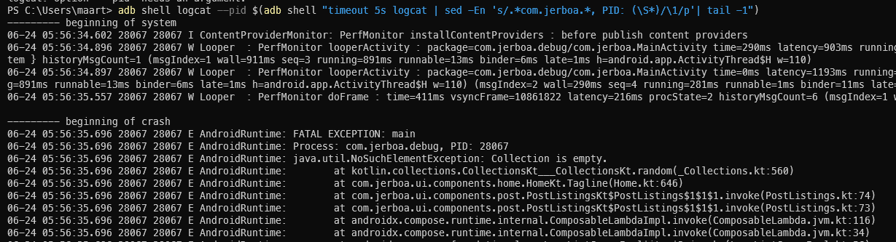

**Jerboa Version**
Type the version from the settings here.

**Android version + phone**
Type here the android version you are using and which phone

**Describe the bug**
A clear and concise description of what the bug is.

**To Reproduce**
Steps to reproduce the behavior:

1. Go to '...'
2. Click on '....'
3. Scroll down to '....'
4. See error

**In the case of a crash**

Please include the logs.

<details><summary>Click here if you don't know how to get the logs</summary>


Follow these steps (skip the ones you already have done):
- Enable developer options and USB DEBUGGING
- Install ADB on your PC
- Connect your phone to your PC
- Execute this command on PC

### To enable developer options and USD DEBUGGING

[Follow this article](https://developer.android.com/studio/debug/dev-options)
In essence you find the build number in About section of settings page and tap it a few times
Then open developer options and enable USB DEBUGGING

### Install ADB on your PC

Download ADB from here [https://adbinstaller.com/](https://adbinstaller.com/)

Unzip it

[(Click here if you wanna know more about ADB)](https://developer.android.com/tools/adb)

### Connect your phone to your PC

Use a USB cable to connect your phone to your PC

### Execute this command on PC
On windows open Powershell in the directory with the adb.exe (where you unzipped it, if you didn't add it to the PATH)

On Unix open a shell in the directory with the adb (where you unzipped it, if you didn't add it to the PATH)

To test if this is working type `adb devices`, this should output a device

Then execute this command `adb shell logcat --pid $(adb shell "timeout 5s logcat | sed -En 's/.*com.jerboa.*, PID: (\S*)/\1/p'| tail -1")`
The above command will print the logs of the latest execution of Jerboa (regardless of which version/build).

That should look like something like this.


Copy the full output. (If not possible just include the few lines below `FATAL EXCEPTION: main` )

Either include it as a file or past it here

```
<details><summary>LOGS</summary>
PASTE HERE AND REMOVE THE ABOVE GUIDE
</details>
```

</details>
