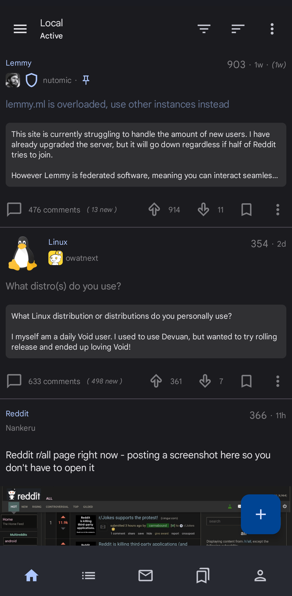
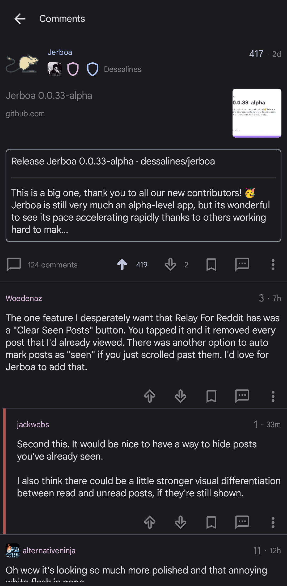

  

  <h3 align="center"><a href="https://github.com/LemmyNet/jerboa">Jerboa</a></h3>
  

    An Android client for <a href="https://github.com/LemmyNet/lemmy">Lemmy</a>, a federated reddit alternative
     
     
    <a href="https://join-lemmy.org">Join Lemmy</a>
    ·
    <a href="https://github.com/LemmyNet/jerboa/issues">Report Bug</a>
    ·
    <a href="https://github.com/LemmyNet/jerboa/issues">Request Feature</a>
    ·
    <a href="https://github.com/LemmyNet/jerboa/blob/main/RELEASES.md">Releases</a>
  

  

    
    
    
    
  

## About Jerboa

| Homepage                                                                   | Post & Comments                                                          |
| -------------------------------------------------------------------------- | ------------------------------------------------------------------------ |
|  |  |

Jerboa is an Android client for Lemmy, built using the native Android toolkit and Jetpack Compose.

**Note**: You can submit issues, but between Lemmy and lemmy-ui, the developers probably won't have too much time to work on them. You can learn Jetpack Compose and contribute if you want to help make this app better.

### Built With

- [Android Jetpack Compose](https://developer.android.com/jetpack/compose)
- [Kotlin](https://kotlinlang.org/)
- [Retrofit](https://square.github.io/retrofit/)

## Features

- Open-source, [AGPL License](/LICENSE).

## Installation / Releases

- [Releases](https://github.com/LemmyNet/jerboa/releases)
- [IzzyOnDroid](https://apt.izzysoft.de/fdroid/index/apk/com.jerboa)
- [F-Droid](https://f-droid.org/en/packages/com.jerboa/)
- [Google Play](https://play.google.com/store/apps/details?id=com.jerboa)

## Support / Donate

Jerboa is made by Lemmy's developers, and is free, open-source software, meaning no advertising, monetizing, or venture capital, ever. Your donations directly support full-time development of the project.

Jerboa and Lemmy are made possible by a generous grant from the [NLnet foundation](https://nlnet.nl/).

- [Support on Liberapay](https://liberapay.com/Lemmy).
- [Support on Ko-fi](https://ko-fi.com/lemmynet).
- [Support on OpenCollective](https://opencollective.com/lemmy).
- [Support on Patreon](https://www.patreon.com/dessalines).

### Crypto

- bitcoin: `1Hefs7miXS5ff5Ck5xvmjKjXf5242KzRtK`
- ethereum: `0x400c96c96acbC6E7B3B43B1dc1BB446540a88A01`
- monero: `41taVyY6e1xApqKyMVDRVxJ76sPkfZhALLTjRvVKpaAh2pBd4wv9RgYj1tSPrx8wc6iE1uWUfjtQdTmTy2FGMeChGVKPQuV`

## Contact

- [Mastodon](https://mastodon.social/@LemmyDev)
- [Jerboa dev chat](https://matrix.to/#/#jerboa-dev:matrix.org)
- [Lemmy chat](https://matrix.to/#/#lemmy:matrix.org)

## Credits

Icons made by [Freepik](https://www.freepik.com) from [www.flaticon.com](https://www.flaticon.com).
